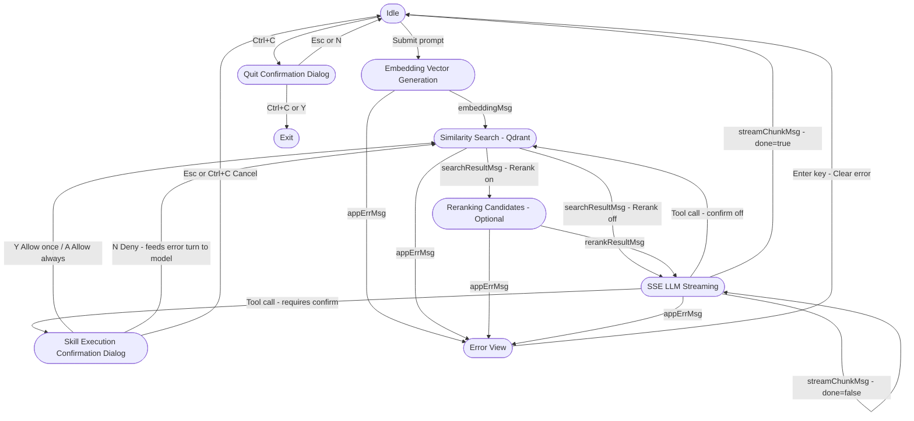

# ◉ QQuestio — Enterprise RAG TUI

<p align="center">
  
</p>

QQuestio is an enterprise-grade, terminal-based Retrieval-Augmented Generation (RAG) user interface built with Go and the **Charmbracelet ecosystem** (`bubbletea`, `lipgloss`, `viewport`, `textinput`, `spinner`).

Designed around the **Nord color palette**, QQuestio delivers a visually stunning, low-latency, and interactive interface for semantic searching and multi-turn conversations with local or hosted LLMs, utilizing a completely non-blocking async HTTP pipelines architecture.

---

## 🌟 Key Features

- **Non-Blocking Async Architecture**: Full background execution of HTTP embeddings, vector similarity search, reranking, and SSE stream reading via structured `tea.Cmd` loops.
- **Real-time SSE Streaming**: High-performance, self-chaining Server-Sent Events parser that prints LLM responses token-by-token directly into a scrollable viewport.
- **Two-Panel TUI Layout**: Split-screen design dividing the screen into a main chat panel (2/3 width) and a scrollable side panel for retrieved document references (1/3 width) that can be focused and scrolled independently.
- **Automatic Session Recovery & Management**: Chronological timestamp-based sessions stored locally in `$HOME/.config/qquestio/sessions`, with quick resume flags (`-c` to recover the latest session or `-c <sessionid>` for specific sessions), printing the active session ID upon quit.
- **Model-Agnostic Generic Reranking**: Optional, generic, and provider-agnostic reranking step that automatically expands the database candidate pool, query-scores retrieved points, and selects the top documents.
- **Full-Corpus Recall by Default**: Uses Qdrant's native exact brute-force search (`params.exact=true`) to score every single vector in the collection server-side, with sub-second latency even for million-scale corpora. An optional `/cap` (or `--search-cap` / `SEARCH_CAP`) switches to HNSW approximate search for reduced latency on extremely large collections.
- **Adjacent-Chunk Context Expansion**: Enabled by default (`/expand`, ±1). Each top match pulls its neighbouring chunks from the same document, so the LLM receives the complete surrounding slice rather than an isolated fragment.
- **Dynamic Slash Commands**: Modify parameters at runtime (e.g., active collection, search limits, or system prompt) or copy transcripts without restarting the TUI.
- **Skills System**: Plug-and-play local tools framework featuring a registry interface and execution dispatcher.
- **Nord Theme Aesthetics**: Sophisticated, premium color design featuring distinct status bars, responsive padding, and dynamic state transitions.

---

## 🛠️ Architecture & FSM

QQuestio is built upon a deterministic State Machine that sequences async pipeline stages:



---

## ⚙️ Configuration

QQuestio supports three configuration methods. Values are merged with the following precedence:
**Local `config.json`** (Lowest) ──► **System Environment Variables** ──► **CLI Flags** (Highest)

### Configuration Options

| Config Key | Env Var | CLI Flag | Description |
|---|---|---|---|
| `qdrant_url` | `QDRANT_URL` | — | **Required.** Base URL of the Qdrant REST API (e.g. `http://localhost:6333`). |
| `qdrant_api_key` | `QDRANT_API_KEY` | — | **Required.** Authentication API key for Qdrant. |
| `qdrant_vector_name` | `QDRANT_VECTOR_NAME` | — | Optional named vector in multi-vector collections (e.g. `dense`). |
| `embedding_url` | `EMBEDDING_URL` | — | **Required.** Base URL of the embedding server (e.g. `http://localhost:8080`). |
| `embedding_api_key` | `EMBEDDING_API_KEY` | — | Optional API key for the embedding endpoint. |
| `embedding_model` | `EMBEDDING_MODEL` | — | **Required.** Embedding model name (e.g. `nomic-embed-text-v1.5`). |
| `openai_url` | `OPENAI_URL` | — | **Required.** Base URL of OpenAI-compatible API (e.g. `http://localhost:4000`). |
| `openai_api_key` | `OPENAI_API_KEY` | — | Optional API key for OpenAI-compatible endpoint. |
| `openai_model` | `OPENAI_MODEL` | — | **Required.** LLM model name (e.g. `meta-llama/Llama-3-8B-Instruct`). |
| `openai_max_tokens` | `OPENAI_MAX_TOKENS` | — | Max completion tokens (default `0` = omit limit). |
| `default_collection` | `DEFAULT_COLLECTION` | — | **Required.** Default Qdrant collection (e.g. `documentation`). |
| `reranker_url` | `RERANKER_URL` | — | Base URL of model-agnostic reranker (e.g. `http://localhost:8080/rerank`). |
| `reranker_api_key` | `RERANKER_API_KEY` | — | Optional API key for the reranker endpoint. |
| `reranker_model` | `RERANKER_MODEL` | — | Optional model name for the rerank endpoint (e.g. `bge-reranker-large`). |
| `reranker_pool` | `RERANKER_POOL` | — | Primary candidates for reranker (default `0` = auto: `3 × /limit`, 10–20). |
| `search_cap` | `SEARCH_CAP` | `--search-cap <N>` | Candidate pool cap; `0` = full corpus (default `0`, e.g. `50000`). |
| `query_rewrite` | `QUERY_REWRITE` | — | Follow-up rewrite mode: `llm` (default), `heuristic`, or `off`. |
| `context_limit` | `CONTEXT_LIMIT` | — | History token budget (default `131072`, auto-compacts at 85%; `0` = off). |
| `http_timeout_seconds` | `QQUESTIO_HTTP_TIMEOUT` | — | Request timeout in seconds for all external API calls (default `60`). |
| `skills_require_confirm` | `QQUESTIO_SKILLS_REQUIRE_CONFIRM` | `--safe` | Confirmation prompt before executing local skills (default `false`). |
| — | — | `--conf <name>` | Select named configuration profile from `config.json`. |
| — | — | `-c [session_id]` | Resume an existing session or the last active session (`-c` alone). |
| — | `QQUESTIO_DEBUG` | `--debug` | Enable debug logging to file (`debug.log`). |

### 1. Example `config.json`
```json
{
  "qdrant_url": "http://localhost:6333",
  "qdrant_api_key": "your-key",
  "embedding_url": "http://localhost:8080",
  "embedding_api_key": "your-embedding-key",
  "embedding_model": "nomic-embed",
  "openai_url": "http://localhost:4000",
  "openai_api_key": "your-openai-key",
  "openai_model": "llama3",
  "openai_max_tokens": 16384,
  "default_collection": "documents",
  "reranker_url": "http://localhost:8080/rerank",
  "reranker_api_key": "your-reranker-key",
  "reranker_model": "bge-reranker-large",
  "reranker_pool": 0,
  "search_cap": 0,
  "query_rewrite": "llm",
  "context_limit": 131072,
  "http_timeout_seconds": 60,
  "skills_require_confirm": false
}
```

> `search_cap` is optional. `0` (or omitted) means **no cap** — QQuestio will search the entire collection before truncating to the requested number of documents.

### 1b. Configuration file location

`config.json` is looked up at `$HOME/.config/qquestio/config.json` first, falling back to `./config.json` in the current directory. Session transcripts live alongside it under `$HOME/.config/qquestio/sessions/`.

### Context accounting

Token usage is estimated, not counted against a real tokenizer (`estimateTokens` in `model.go`): non-ASCII runes (CJK, emoji, accents) count as ~1 token each, and remaining ASCII bytes count at 4 bytes ≈ 1 token. The estimate covers the conversation text plus the current query's retrieved chunks — historical references stay in the transcript but are not replayed into later prompts. When the server returns usage in the SSE stream, the actual figure is used for the session token counter instead (a `~` prefix in the header marks a fallback estimate).

### 2. Multi-Profile Configurations
You can define multiple named configuration profiles inside a `"configurations"` block in your `config.json`. This allows you to configure completely different databases, models, endpoints, timeouts, and collections, and easily switch between them.

All configurations inherit from the top-level (root) configuration fields. You only need to define the keys you want to override for that specific profile.

#### Example Multi-Profile `config.json`
```json
{
  "qdrant_url": "http://localhost:6333",
  "qdrant_api_key": "local-key",
  "embedding_url": "http://localhost:8080",
  "embedding_model": "nomic-embed",
  "openai_url": "http://localhost:4000",
  "openai_model": "llama3",
  "default_collection": "documents",

  "default_configuration": "dev",

  "configurations": {
    "dev": {
      "default_collection": "dev-docs",
      "openai_model": "llama3-dev"
    },
    "production": {
      "qdrant_url": "https://production-db.qdrant.io:6333",
      "qdrant_api_key": "prod-secret-key",
      "default_collection": "prod-docs",
      "openai_url": "https://api.openai.com/v1",
      "openai_api_key": "your-openai-api-key",
      "openai_model": "gpt-4o"
    }
  }
}
```

#### Switching Configurations
- **From CLI:** Start QQuestio using a specific profile name with the `--conf` flag:
  ```bash
  ./qquestio --conf production
  ```
- **At Runtime:** Switch configuration profiles instantly inside the terminal UI chat input using the `/conf` command:
  ```text
  /conf production
  ```
- **List Profiles:** Running `/conf` without arguments lists the active configuration and all available configuration profiles:
  ```text
  /conf
  ```

---

## 💬 Interactive Slash Commands

Change state parameters or trigger clipboard actions at runtime from the prompt input:

- **`/collection <name>`**: Switches the active vector store collection instantly.
- **`/conf [name]`**: Views the active config profile and all available configuration profiles, or switches to a different profile at runtime (e.g. `/conf production`).
- **`/limit <1-100>`**: Sets the number of context documents (`docs`) to RETRIEVE into the prompt. This is the return-count side of the search; see [Search Scope vs. Return Count](#-search-scope-vs-return-count).
- **`/context [N|off]`** (alias: `/ctx`, `/maxcontext`, `/contextlimit`): Sets or views the maximum context token limit at runtime (e.g. `/context 128k`, `/context 64000`, `/context off`).
- **`/expand <N|off>`**: Pulls ±`N` adjacent chunks from the same document around each match, reassembling fragmented context. `off`/`0` restores legacy top-N-only retrieval. **Default is `1`**; maximum `20` (each step widens the candidate pool and slows the query).
- **`/cap [N|off|auto|exact|local]`**: Sets or clears the candidate-pool cap and doubles as a shortcut for the search-mode selector (see `/search`). `/cap 50000` → HNSW approximate top-50k; `/cap off` (or `none`/`unlimited`) → no cap, full-corpus search; `/cap auto`, `/cap exact`, `/cap local` → set the search mode without touching the numeric cap. `/cap` alone prints the current cap and mode. See [Search Scope vs. Return Count](#-search-scope-vs-return-count).
- **`/search <auto|exact|local>`**: Selects the vector search strategy independently of the cap. `auto` (default) → HNSW when a cap is set, server-side exact search when it is not; `exact` → always force Qdrant server-side brute-force (`params.exact=true`); `local` → client-side brute-force scored on all local CPU cores from the on-disk corpus cache (fallback for servers that reject `params.exact=true`). `/search` alone prints the current mode.
- **`/exact <phrase...>`**: Runs an immediate exact-string search for the phrase, bypassing vector similarity. Quoting an entire query triggers the same path automatically, and quoted substrings inside a normal query are extracted as exact phrases.
- **`/filter <key> <value>`** (or **`/filter <value>`**, or **`/filter clear`**): Filters vector search by exact metadata match (e.g. `/filter file_name guide.txt`). With a single argument the value is matched against *any* document field. Surrounding quotes on the value are stripped.
- **`/mode <strict|hybrid>`**: Switches between strict closed-book RAG and hybrid general-knowledge RAG modes.
- **`/rewrite [llm|heuristic|off]`**: Controls how follow-up questions are rewritten before embedding — `llm` (default, model-assisted), `heuristic` (pronoun detection), or `off` (send the raw query). `/rewrite` alone prints the current mode.
- **`/rerank <on|off>`**: Enables or bypasses the optional reranker step. If the reranker is unreachable at query time, QQuestio degrades gracefully to vector ranking and flags the turn as degraded.
- **`/rerankerpool <N|auto>`**: Sets how many primary candidates are forwarded to the reranker. Smaller pools protect the calibration of small-to-medium reranker models, which degrade beyond ~20 candidates per call. `auto` (default) sizes it as `3 × /limit`, clamped to 10–20.
- **`/cache [status|refresh|warmup|clear|dir]`**: Inspect or control the on-disk corpus cache. `/cache warmup` pre-populates the cache for offline use; `/cache refresh` re-scrolls Qdrant on the next full-corpus query.
- **`/system <prompt...>`**: Re-defines the active RAG system instructions for subsequent turns.
- **`/compact [N]`**: Compacts older history to free up context space, leaving the last `N` Q&A pairs intact (default 3). Auto-triggers at 85% of `CONTEXT_LIMIT`.
- **`/clear`**: Clears the conversation history, retrieved references, and context strings (retains prompt input history).
- **`/copy`**: Copies the last assistant response (or the retrieved references if the references panel is focused) to the clipboard.
- **`/copy ref`** (or **`/copy refs`**): Copies the last retrieved references directly to the clipboard.
- **`/copy all`**: Formats and copies the entire clean conversation transcript to the clipboard.
- **`/save <file.md>`** (or **`/write <file.md>`**): Saves the last assistant response directly to a local markdown file.
- **`/save all <file.md>`** (or **`/write all <file.md>`**): Formats and writes the entire conversation transcript (in full Markdown with headers, prompts, code fences, and retrieved references) directly to a local markdown file.
- **`/help`**: Shows the help menu outlining commands and shortcut keys.
- **`/quit`**: Exits the application.

> Slash-command overrides take precedence over CLI flags, which in turn take precedence over environment variables and `config.json`. So `/cap 20000` after launch will override any `--search-cap`, `SEARCH_CAP`, or `search_cap` set at startup.

---

## 🔍 Search Scope vs. Return Count

QQuestio picks between three search strategies from the `cap` and `search mode` settings:

| Strategy | When | How it works |
|---|---|---|
| **Exact search** (default) | No cap, mode `auto` or `exact` | Sends `params.exact=true` to Qdrant's `/points/query` API. Qdrant performs a brute-force scan of the **entire collection** server-side using SIMD-optimized vector math. Sub-second even for millions of vectors. The primary top-N matches are then widened by `/expand` via batched parallel scroll requests. |
| **HNSW search** | `cap > 0` (mode `auto`) | Sends the cap as the `limit` to Qdrant's HNSW index. Faster for very large collections, but approximate (may miss some true nearest neighbors). Context expansion is bypassed on this path. |
| **Local brute-force** | No cap, mode `local` | Streams every vector through `/points/scroll`, caches it on disk, and computes cosine similarity client-side across all local CPU cores. Network-bound and slower, but works when Qdrant refuses `params.exact=true`. |

Setting a cap does not force HNSW: with `/search exact` and a cap set, QQuestio still requests exact scoring over the capped candidate pool. The cap acts as a floor, never below the internally computed candidate pool.

| Knob | Meaning | Default | Where to set it |
|---|---|---|---|
| **Candidate pool** (`candidateLimit`) | How many candidates Qdrant considers during HNSW search (only when capped) | Entire collection (exact search) | `search_cap` / `SEARCH_CAP` / `--search-cap` / `/cap` |
| **Return count** (`docs`) | How many of the top candidates are actually injected into the LLM prompt | `10` | `/limit` |
| **Expansion** (`expand`) | Adjacent chunks pulled from the same document around each match | `±1` | `/expand` |
| **Strategy** (`searchMode`) | `auto`, `exact`, or `local` | `auto` | `/search` (or `/cap auto|exact|local`) |

The header bar shows the live values on its second line, e.g.:

```text
DB: http://localhost:6333 (✓)  │  Col: documents  │  Limit: 10  │  Expand: ±1  │  Cap: none  │  Search: auto  │  Cache: 12.4k pts  │  RAG: strict  │  Ctx: 8.2k/131k (6%)  │  Tokens: 41.2k
```

### When to use `/cap` and `/search`

- **Leave both unset (default)** for most collections. Qdrant's exact search handles millions of vectors in under a second.
- **Set `/cap 50000` (or similar)** if you have a multi-hundred-million-vector collection and need the fastest possible response.
- **Use `/cap off`** to restore full-corpus search after a cap was set.
- **Use `/search local`** only if your Qdrant deployment rejects `params.exact=true`; pair it with `/cache warmup` so the corpus is already local.

---

## ⌨️ TUI Keybindings

Keyboard shortcuts are active global overlays and can be triggered without losing focus on the prompt input line:

- **`Enter`**: Submit prompt query or execute slash command. (In `ERROR` state, clears the error).
- **`Ctrl+C`**: Triggers a non-blocking quit confirmation dialog in the footer. Press again or type `Y` to confirm; press `Esc` or type `N` to cancel.
- **`Double Escape` (press `Esc` twice)**: Cancel in-flight prompt generation (embeddings, search, reranking, or streaming) and return gracefully to the idle state.
- **`Ctrl+R`**: Toggle viewport view mode between styled Glamour Markdown and raw Markdown source.
- **`Tab`**: Toggle active focus between the main chat panel and the right-hand references panel (visually marked by a highlighted border).
- **`Mouse Click`**: Click on either panel to focus it directly.
- **`Ctrl+Y`**: Copy the last response (or retrieved references if the references panel is focused) directly to your system clipboard.
- **`Ctrl+Up` / `Ctrl+Down`**: Scroll the focused viewport (chat response or references panel) up and down by single lines.
- **`PageUp` / `PageDown`**: Scroll the focused viewport up and down by half pages.
- **`Up` / `Down` arrow keys**: Navigate back and forward through your entered prompts history (when cursor is focused on the input prompt line).

---
## 💾 Session Management

QQuestio automatically tracks and serializes your conversations to keep your context saved between runs.

- **Storage Path**: `$HOME/.config/qquestio/sessions/*.json`
- **Session IDs**: Chronological timestamp identifiers (e.g. `20260619-114154`).
- **Exiting TUI**: Upon exit, the active session is saved, and its ID is printed to the terminal:
  ```bash
  Session ID: 20260619-114154
  ```
- **Resuming the Last Session**: Resume your last conversation and settings:
  ```bash
  ./qquestio -c
  ```
- **Resuming a Specific Session**: Recover a specific past session by ID:
  ```bash
  ./qquestio -c 20260619-114154
  ```

---

## 🔌 Skills System (Local Agentic Tools)

QQuestio features a plug-and-play **Skills System** that allows the LLM to dynamically execute local actions on your machine and incorporate their results directly into the conversation.

### How It Works

1. **Tool Definition**: Skills implement the `Skill` interface, which defines a name, description, and an `Execute(ctx context.Context, args []byte) (string, error)` entrypoint. Arguments arrive as raw bytes — the built-in `bash` skill accepts either a JSON object (`{"command": "..."}`) or a plain command string.
2. **LLM Prompting**: When the registry has registered skills (such as the default `bash` skill), descriptions of these tools are dynamically injected into the system prompt.
3. **Execution Loop**:
   - If the LLM determines it needs a tool, it outputs a command using the syntax:
     ```text
     CALL: <tool_name> <arguments>
     ```
   - The TUI detects this output, pauses LLM streaming, executes the skill asynchronously (non-blocking), formats the execution output, and feeds it back into the model's chat history.
   - The TUI then restarts streaming, letting the LLM react to the execution results and finish its explanation.

### Confirming Skill Execution

When `--safe`, `QQUESTIO_SKILLS_REQUIRE_CONFIRM`, or `skills_require_confirm` is enabled, each call halts on a confirmation dialog:

| Key | Effect |
|---|---|
| `Y` | Allow this one call |
| `A` | Allow this skill for the rest of the session (reset by `/conf`) |
| `N` | Deny — a synthetic error turn is fed back so the model can recover |
| `Esc` / `Ctrl+C` | Cancel the call without reporting anything to the model |

### Default Skills

*   **`bash`**: Executes a bash command in a subprocess (`/bin/bash`, falling back to `/bin/sh`, then a `PATH` lookup) on the client machine and returns combined stdout and stderr to the LLM. The process is killed if it runs longer than 30 seconds.

---

## 🏗️ Development & Building

A comprehensive cross-compilation suite is configured in the `Makefile`.

### Local Build & Test
```bash
# Run test suite (includes mock HTTP test servers for embeddings, qdrant, rerank, and SSE streams)
make test

# Build local binary
make build

# Launch the app (ensure environment variables or config.json are set)
./qquestio
```

### Cross-Compilation (Pre-building for Releases)
To build for all supported targets, run:
```bash
make build-all
```
This generates binaries inside the `bin/` directory for:
- **Linux**: AMD64 and ARM64
- **Windows**: AMD64 and ARM64 (executable `.exe`)
- **macOS / Darwin**: AMD64 (Intel) and ARM64 (Apple Silicon)

```bash
# Clean up build artifacts and logs
make clean
```
